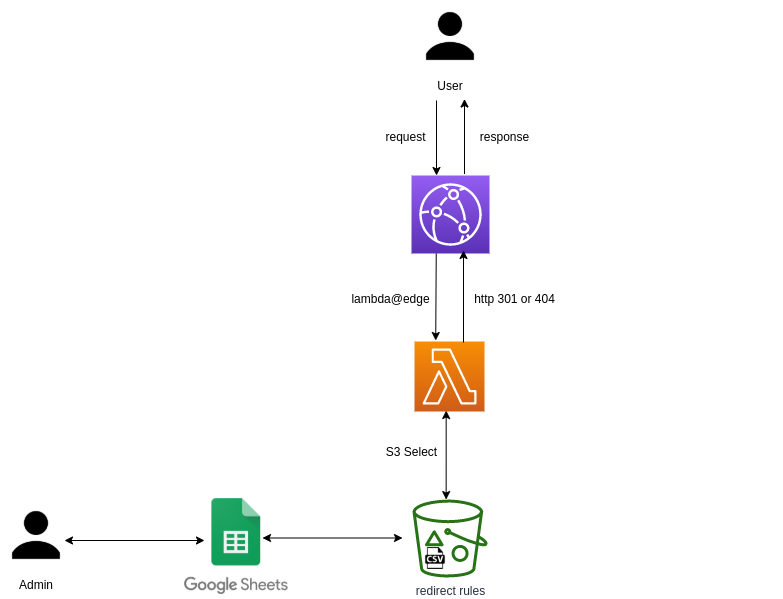

# Universal cloud redirector

Motivation: replace Apache & Nginx rewrite rules and make them cloud and "business" friendly.

Key parts:

* **Cloudfront** + **Lambda@Edge** 
* **S3 Select** to query rules and regexp.

# How to setup

You can setup different rules:

* simple rules (rules.csv)
* complex rules (regexp.csv)

Complex rules are the fallback when a path is not found.

Other variables are available in [setup.demo.json](setup.demo.json):

* Cloudfront TTL
* Bucket and files names
* x-api-key to invalidate cache
* a fake origin that never will be reached 

You can have serverals DNS over a distribution, and rules and regexp are dependant on host domain.

## Rules example format

host                            | path                     | redirect
--------------------------------|--------------------------|------------------------
xxxx.cloudfront.net             | /dev                     | https://developer.mozilla.org/  
subdomain.yourdomain.net        | /search                  | https://www.google  

## Regexp example format

host                            | regexp                   | redirect
--------------------------------|--------------------------|------------------------
xxxx.cloudfront.net             | /directory?page=(.*)     | https://application.yourdomain/folder/folder1/?page=$1  

# Endpoints (cloudfront behaviors)

* **/{whatever}** > it will search for {whatever} and the host requested into the CSV
    * first search is into simple rules csv. If not found, it maps query against regexp file. 
    * regexp file is "cached" to avoid continuous S3Select queries. You can refresh it sending a POST request to your cloudfront endpoint withyour x-api-key
    * if a path is found, a 301 redirect is returned. If not, 404. 
* **/invalidate/** --> POST. It will generate a invalidation request. Params
    * x-api-key: defined in setup.demo.json
    * x-invalidatepaths: a string containing the paths to invalidate, comma separated
* /sign/ --> it will return a S3 signed form to upload a rules.csv file (not used at this time). Params:
    * x-api-key: defined in setup.demo.json

# Notes

* Distribution id has to be set manually in setup.demo.json after a first deploy of the stack... 

# Some tips about cloudfront and lambda@edge

* https://medium.com/@mnylen/lambda-edge-gotchas-and-tips-93083f8b4152
